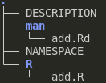
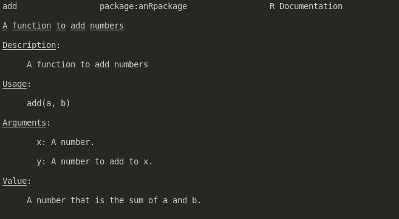
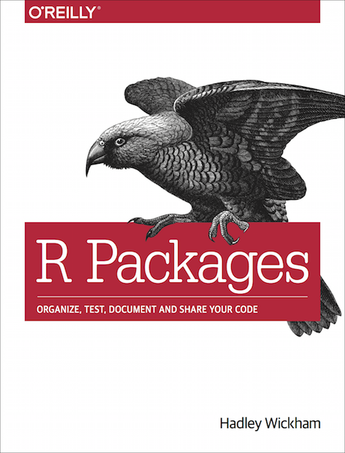

# What is software?

- Basically any code (analysis scripts...)

--

or

- Code that's been written in such a way as to be reusable

--

or 

- Code structured and designed to interface with other pieces of software

--

or 

- Code structured and designed to interface with other pieces of software,
  and to be extensible in future

---

# Why should you develop software rather than analysis scripts?

- Portability

- Testing

- Reuse

- Extensibility

- Longevity


---

# Why should you publish software in R?

- You've written useful code

- People want to use your code

- You think your code could make other people's lives easier

- You want to make your method work well with other methods

---

# What does it mean to publish software?

- Publishing the code for a paper as you wrote it as a supplementary file.

or 

- Keeping some reusable code on a shared location for your colleagues.

or

- Keeping some reusable code on a website for your colleagues and other.

or

- Publishing reusable code to a central, curated, repository.

---


# How can you develop software in R?

The basic structure of an R package is:

```{r, echo = FALSE}

```

This can be made with `package.skeleton` or `devtools::create`.

---

# What are .Rd files?

`.Rd` files contain documentation files for interactive use.

Can be created with [`roxygen`](https://roxygen2.r-lib.org/).

```r
#' A function to add numbers
#' @param x
#' @param y
#' @importFrom stats setNames
#' @export
add <- function(a, b) a + b
```

This results in a help page `help("add")`:

```{r, echo = FALSE, out.width = "400px"}

```

---

# What is a NAMESPACE?

This is a file that describes:

- what functions are imported from other
  packages for use internally

- which functions we make available
  for other functions to use.

From the previous example:

```r
export(add)
importFrom(stats,setNames)
```

---

# Using native code

Using native code expands this a bit to add a `src` directory.

```{r, echo = FALSE}

```

You can also include `src/Makevars` to change compiler behaviour.

There are a lot of header-only libraries that you can link to.

This can be made with `Rcpp::Rcpp.package.skeleton`.
There are other similar tools like `rstantools::rstan_create_package`.


---


# How should you develop software for R?

Version Control System:
  - git

  - SVN

  - hg

Uses:
- collaboration

- tracking changes

- versioning (with backtracking)

- branches

- blame             /s

---

# Where should you develop software for R?

VCS also provide access to VC platforms.

These provide a number of benefits:

- Issue tracking (bug/feature request)

- Projects and milestones

- Visibility and collaboration

- Continuous integration (more on this later)

---

# Version control platforms

- [github.com](https://www.github.com):
  - Open platform.
  - May or may not cost money depending on what you need.
  - Widely used (means usually somebody's solved your problem).
  - Public and highly visible.
  - Can use [git lfs](https://git-lfs.github.com/) at a truly outrageous cost.


- gitlab
  - May or may not last forever, depending on how IT feels in future.
  - Can use [git lfs](https://git-lfs.github.com/) to store large files
    (this isn't necessarily a good idea).
  - Public and private repositories.
  - May be hard to configure some elements.
  - Edinburgh provides a gitlab instance at [git.ecdf.ed.ac.uk](https://git.ecdf.ed.ac.uk):
      * Closed platform (UoE only?).
  - [gitlab.com](https://gitlab.com):
      * May or may not cost money depending on what you need.
      * Open platform.

- [bitbucket.org](https://bitbucket.org/)
  - Also exists

---

# Continuous integration

Making sure your software works on different systems can be difficult.

VCS platforms make this easy by allowing you to run checks and tests
on every version.

[github actions](https://github.com/r-lib/actions) allows you to
run tests, build containers, archives, etc, on:
- macOS
- Windows (allegedly)
- Linux flavours


---

# Resources for learning R software development

Learning how to write an R package isn't totally straightforward.
Some resources:

```{r, echo = FALSE, out.width = "250px"}

```
```{r, echo = FALSE, out.width = "200px"}
knitr::include_graphics("adv-r.png")
```

---


# Where can you publish software in R?


CRAN:

- Publishes R packages.

- Very public & popular; always available.

- Rolling releases:

  - Everything works with everything all the time.

  - If something breaks your package at any point, it'll go from CRAN.
  
- Submission and updates via `tar.gz` archives.

- Reviewed by volunteers on submission and update.
  - Reviews may sometimes be... terse.

---

# CRAN submission process

1. On the web
  - Make a tar archive

  - Visit [the submit page](https://cran.r-project.org/submit.html)

  - Upload the tar archive

2. `devtools::release()`

Either way, they like to have comments about what's changed in `cran-comments.md`.

Then wait for comments from the CRAN reviewers.

---

# Where can you publish software in R?

Bioconductor:

- Publishes R packages for biosciences

- Twice yearly releases (~spring and ~autumn)

  - Everything works within a version (except CRAN)

  - If your package is broken at release time, it'll be removed

- Submission and updates via git

- Reviewed by staff on submission via github issue

---

# Bioc submission process

- Submit issue on [Bioconductor/Contributions/issues/](https://github.com/Bioconductor/Contributions/issues/)

- Repository is added to Bioconductor git.

- Package is checked on Bioconductor Single Package Builder.

- Bioc staff review your package (documentation, coding practices, unit tests).

- Changes after review.

- If accepted, enters the Bioconductor Build System (BBS).

---


# Bioconductor Build System

All Bioc software packages are built and checked nightly.

There are RSS feeds to check build status.

```{r, out.width = "500px", echo = FALSE}

```

You can also set up badges that detail the build status

```{r, out.width = "400px", echo = FALSE}
knitr::include_graphics("ltla-pkgs.png")
```

---

# Bioconductor package versions

Semantic versioning for software usually goes:

`major.minor.patch`

In Bioconductor, they use a different system.

`major.even.patch` is the `release` branch (eg, the the `3.15`)

`major.odd.patch` is the `devel` branch.

With a new Bioc release (current is Bioc 3.14), `devel` becomes the new
`release`.

---


# Bioconductor package versions (example)

My package `exemplar` is submitted as version 0.99.0.

When accepted, it's available in the current Bioc `devel` version, 3.15.

In spring, a new release blossoms from the earth, and Bioc version 3.15 is
now the `release` version. `exemplar` 0.99.0 becomes `exemplar` 1.0.0 in release.

The new `devel` version of Bioc, 3.16, includes the `devel` version of
`exemplar`, 1.1.0.

If I find a bug in `exemplar` 1.0.0, I can push a fix as 1.0.0; however
new features and other major changes are forbidden.

I can add new features and bug fixes to `exemplar` 1.1.0 as versions 1.1.1,
1.1.2...

`exemplar` 1.1.z becomes `exemplar` 1.2.0 in the next release...

---


# Where to learn about Bioconductor

- [Bioconductor slack](https://bioc-community.herokuapp.com/)

- [Bioconductor developers' guide](https://www.bioconductor.org/developers/)

- [bioc-devel mailing list](https://stat.ethz.ch/mailman/listinfo/bioc-devel)

- [Bioconductor new developer program](https://bioconductor.org/developers/new-developer-program/)

---

# Other thoughts

- The IGMM social committee is looking for new volunteers!  
  It's a great way to keep the place lively outside of strictly academic
  gatherings.

- The Computational Biology journal club has also lapsed.  
  This was a great way to share ideas, knowledge and interesting papers, helped
  by great pizza donations from some kind research groups.

