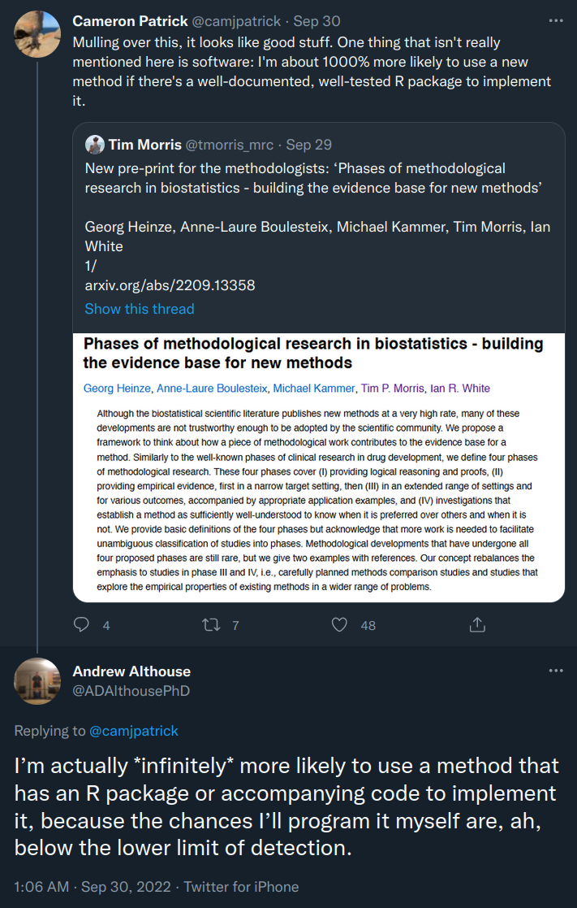

# What is software?

- Basically any code (analysis scripts...)

--

or

- Code that's been written in such a way as to be reusable

--

or 

- Code structured and designed to interface with other pieces of software

--

or 

- Code structured and designed to interface with other pieces of software,
  and to be extensible in future

---

# What does it mean to publish software?

- Publishing the code for a paper as you wrote it as a supplementary file.

--

or

- Keeping some reusable code on a code repository website.

--

or

- Publishing reusable code to a central, curated, repository.

---

# Why should you publish software in R?

(altruistically)

- You've written useful code.

- People want to use your code.

- You think your code could make other people's lives easier.

- You want to make your code work well with other people's code.

<!-- "Publishing" can be for a public or private audience. -->

---

# Why should you publish software in R?

(selfishly)


```{r, out.width = "300px", echo = FALSE}

```

---

# Why shouldn't you publish software?

(altruistically)

- It's a lot faster to crank out papers than to write good code, and the former
is probably better for your PI/department long term (no maintenance responsibility)

- Odds are good nobody's going to read your code either way, and if it works it works
regardless of how much of a house of cards it is

- Is abandonware a better look than a cobbled-together R script anyway?

---

# Why shouldn't you publish software?

(selfishly)

- Issues and bug reports are frequently not communicated in the best way.

- People are quick to ask for new features but very slow to help out.

- Unless you can convince somebody else to take over, you have to choose between
letting the software die and maintaining it forever.

---

# Resources for learning R software development

Learning how to write an R package isn't totally straightforward.
Some resources:

```{r, echo = FALSE, out.width = "250px"}
knitr::include_graphics("r-pkgs.png")
```
```{r, echo = FALSE, out.width = "200px"}
knitr::include_graphics("adv-r.png")
```

---

# How can you develop software in R?

The basic structure of an R package is:

```{r, out.width = "200px", echo = FALSE}
knitr::include_graphics("tree-example-small.png")
```

---

# Vignettes

Packages can also contain long-form documentation in the form of vignettes.

These are typically used to show an overall workflow in the form of a PDF or
HTML document.

```{r, out.width = "200px", echo = FALSE}

```


---

# Unit tests

These check that the functions in your package behave as expected.
An example using [`testthat`](https://testthat.r-lib.org/):

```r
test_that("add works", {
  expect_equal(add(1, 1), 2)
})
```

It's great to test "weird" cases and to add a test any time you find a bug
(to make sure you fixed it, and it never pops up again).

---

# Including data in an R package

R packages can also include small (<MB) datasets in the `data` folder:

```{r, out.width = "200px", echo = FALSE}
knitr::include_graphics("tree-example.png")
```

Typically `data-raw` holds the scripts used to create the data.

---

# R package as a container for analysis

What I have seen done is:

`data-raw/` contains lengthy pre-processing code to make `data/` objects

`R/` contains functions for munging the data, making common figures etc

`tests/` contains unit tests for `R/`

`vignettes/` contains basically a manuscript; probably this is written in shorthand
because it's hard to make a vignette submittable as journal article/preprint

Thoughts?

---

# Data packages

As part of Bioconductor there are a number of [ExperimentData](https://www.bioconductor.org/packages/release/data/experiment/) packages.

These do not contain (much) code, but rather serve as a way to access data.

Publishing data for easy use in R make it easier for people to use your data,
which may increase citations for your paper(s).

One example: the [scRNAseq](https://bioconductor.org/packages/release/data/experiment/html/scRNAseq.html) package.

```{r, echo = FALSE, out.width = "300px"}

```

---

# Learning about Bioconductor

- [Bioconductor slack](https://bioc-community.herokuapp.com/)

- [Bioconductor new developer program](https://bioconductor.org/developers/new-developer-program/)***

---

# rOpenSci

[rOpenSci](https://ropensci.org/) attempts to address some of the limitations of
CRAN by:

- Creating infrastructure

- Encouraging discoverability

- Building community

- Providing a vetted ecosystem

- Peer reviewing submissions

---

# SLOcator

[SLOcatoR](https://github.com/massonix/SLOcatoR) is a method package that aims
to allow annotation of scRNAseq or scATAC-seq data from secondary lymphoid organs
using the Human Cell Atlas tonsil data as reference.

--

This was split into a method package and a data package, with the data being:
[HCATonsilData](https://github.com/massonix/HCATonsilData/)

--

This uses data hosted in Bioc AWS buckets and some clever caching to save
bandwidth (otherwise anyone installing the package would have to download ~GB
of data).

The caching is done using [ExperimentHub](https://www.bioconductor.org/packages/release/bioc/html/ExperimentHub.html).

---

# GWAS cell typer

[gwascelltyper](https://github.com/alexandruioanvoda/gwascelltyper/)
is a packagee that wraps a couple of methods for computing cell type 
specificity measures of GWAS based on genes or gene lists.

Again there's some reference data that can be handled with ExperimentHub.

--

This involves munging data between formats for different tools (fun!)
and calling some commandline programs in native code.


Calling native code from R is tricky; it usually requires compiling the code
as part of a package...

--

[basilisk](https://www.bioconductor.org/packages/release/bioc/html/basilisk.html)
is a package that builds on [reticulate](https://github.com/rstudio/reticulate/)
to be able to make conda environments as part of an R package.

So you can now bundle any executable that's on conda with an R package. Or
run arbitrary python modules with semi-decent environment management.

Some of these programs have restrictive licenses though, so they aren't on
conda...

---

# basilisk

```{r, eval = FALSE}
bcf_env <- BasiliskEnvironment("bcf_env", pkgname = "baseqtl",
    packages = c("bcftools==1.15.1", "scikit-learn=1.1.1"),
    channels = "bioconda")

run_function <- function(...) {
    cl <- basiliskStart(bcf_env)
    on.exit(basiliskStop(cl))
    basiliskRun(cl, function(...) {
        system("bcftools blah")
        # or
        sklearn <- reticulate::import("sklearn")
        sklearn$fun(arguments)
    })
}
```

---

# Summary

Bioconductor has a lot of neat functionality and community.

Mentorship is tricky; don't want to handhold but also don't want things to drag
on indefinitely.

If you'd like to get involved just do; I've done bits and pieces so anybody
can.
