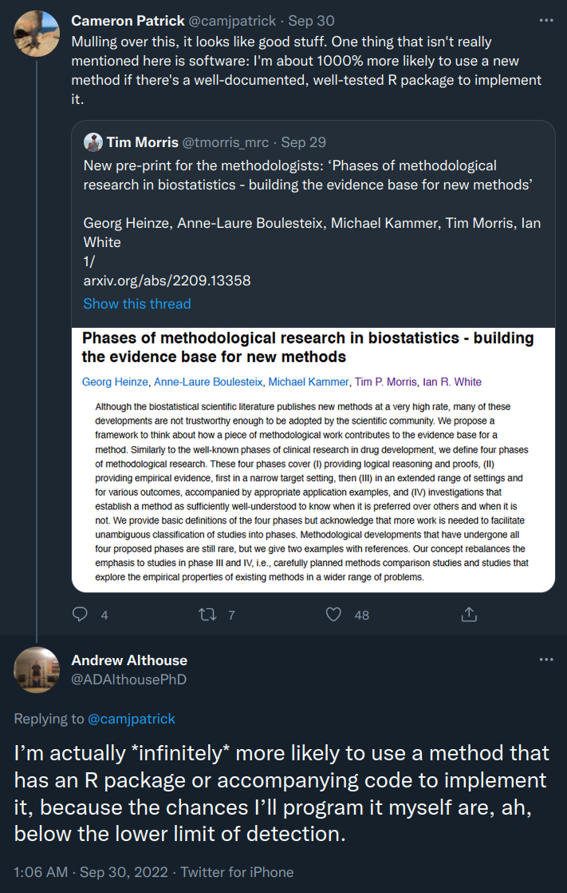
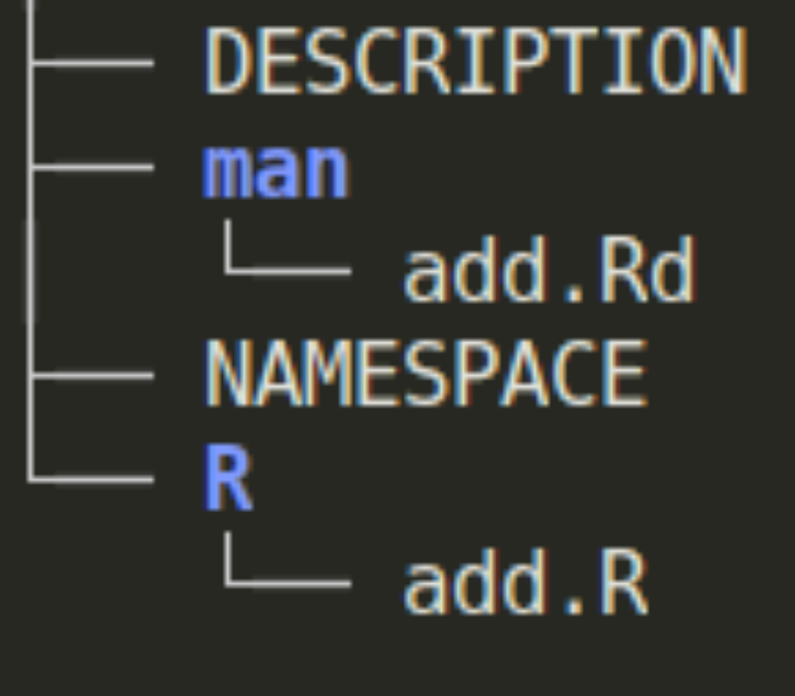
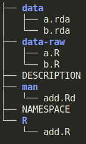
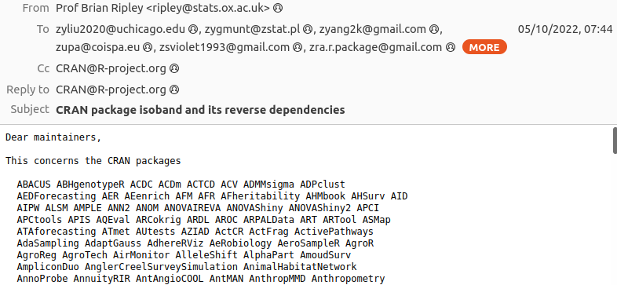
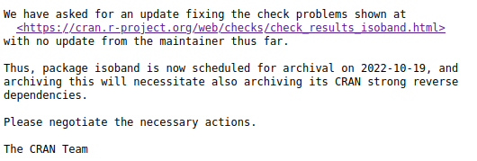

<style type="text/css">
  body{
  font-size: 12pt;
}
</style>

# Outline

What is software, and why should we care?

--

What makes good open science software?

--

How and where can you publish it?

---


# What is software?

- Basically any code (analysis scripts...)

--

or

- Code that's been written in such a way as to be reusable

--

or 

- Code structured and designed to interface with other pieces of software

--

or 

- Code structured and designed to interface with other pieces of software,
  and to be extensible in future

---

# What does it mean to publish software?

- Publishing the code for a paper as you wrote it as a supplementary file.

--

or

- Keeping some reusable code on a code repository website.

--

or

- Publishing reusable code to a central, curated, repository.

---

# Why should you publish software in R?

(altruistically)

- You've written useful code.

- People want to use your code.

- You think your code could make other people's lives easier.

- You want to make your tool or method work well with other methods.

<!-- "Publishing" can be for a public or private audience. -->

---

# Why should you publish software in R?

(selfishly)


```{r, out.width = "300px", echo = FALSE}

```


---

# Why software, not just scripts?

- Portability

- Reliability

- Reuse

- Extensibility

- Longevity

---

# Resources for learning R software development

Learning how to write an R package isn't totally straightforward.
Some resources:

```{r, echo = FALSE, out.width = "250px"}
knitr::include_graphics("r-pkgs.png")
```
```{r, echo = FALSE, out.width = "200px"}
knitr::include_graphics("adv-r.png")
```
---


# How can you develop software in R?

The basic structure of an R package is:

```{r, out.width = "200px", echo = FALSE}

```

This can be made with `package.skeleton` or `devtools::create`.

---

# What is man?

`man` contains documentation files. For example, the following `add.R` file
contains documentation about the `add` function:


```r
#' A function to add numbers
#' @param x A number.
#' @param y A number to add to x.
#' @return A number that is the sum of x and y.
#' @export
add <- function(x, y) x + y
```

Can be created with [`roxygen`](https://roxygen2.r-lib.org/).
You can also add documentation about your entire package, about classes,
and about data objects.

---

# Unit tests

These check that the functions in your package behave as expected.
An example using [`testthat`](https://testthat.r-lib.org/):

```r
test_that("add works", {
  expect_equal(add(1, 1), 2)
})
```

It's great to test "weird" cases and to add a test any time you find a bug
(to make sure you fixed it, and it never pops up again).

---


# Including data in an R package

R packages can also include small (<MB) datasets in the `data` folder:

```{r, out.width = "200px", echo = FALSE}

```

Typically `data-raw` holds the scripts used to create the data.


---


# Where should you develop software for R?

The first step to publishing software in R is often using platforms like GitHub.

These provide a number of benefits:

- Issue tracking (bugs/feature requests)

- Projects and milestones

- Visibility and collaboration

- Continuous integration*

---


# Where can you publish software in R?

CRAN:

- Publishes R packages.

- Very public & popular.

- Rolling releases:

  - Everything works with everything all the time.

  - If something breaks your package at any point, it'll go from CRAN.***
  
- Submission and updates via `tar.gz` archives.

- Reviewed by volunteers on submission and update.
  - Communication may sometimes be... terse.

---

# CRAN communication

```{r, out.width = "400px", echo = FALSE}

```

...

```{r, out.width = "300px", echo = FALSE}

```
---


# Where can you publish software in R?

Bioconductor:

- Publishes R packages for biosciences

- Encourages interoperability and building infrastructure

--

- Twice yearly releases (~spring and ~autumn)

  - Everything works within a version (except CRAN)

  - If your package is broken at release time, it'll be removed

--

- Submission and updates via git

- Reviewed by staff on submission via github issue

---

# rOpenSci

[rOpenSci](https://ropensci.org/) attempts to address some of the limitations of
CRAN by:

- Creating infrastructure

- Encouraging discoverability

- Building community

- Providing a vetted ecosystem

- Peer reviewing submissions

---

# Bioc submission process

- Submit issue on [Bioconductor/Contributions/issues/](https://github.com/Bioconductor/Contributions/issues/)

--

- Repository is added to Bioconductor git.

--

- Package is checked on Bioconductor Single Package Builder.

--

- Bioc staff review your package (documentation, coding practices, unit tests).

--

- Changes after review.

--

- If accepted, enters the Bioconductor Build System (BBS).

---

# Data packages

As part of Bioconductor there are a number of [ExperimentData](https://www.bioconductor.org/packages/release/data/experiment/) packages.

These do not contain (much) code, but rather serve as a way to access data.

Publishing data for easy use in R may increase citations for your paper(s).

---


# Where to learn about Bioconductor

- [Bioconductor slack](https://bioc-community.herokuapp.com/)

- [Bioconductor developers' guide](https://www.bioconductor.org/developers/)

- [bioc-devel mailing list](https://stat.ethz.ch/mailman/listinfo/bioc-devel)

- [Bioconductor new developer program](https://bioconductor.org/developers/new-developer-program/)

---

# Summary

Publishing software is good research practice.

Making software FAIR is an important part of open science.

CRAN is a great resource but may not be enough for good open science.

Bioconductor and rOpenSci quality, stable platform, with great support.
